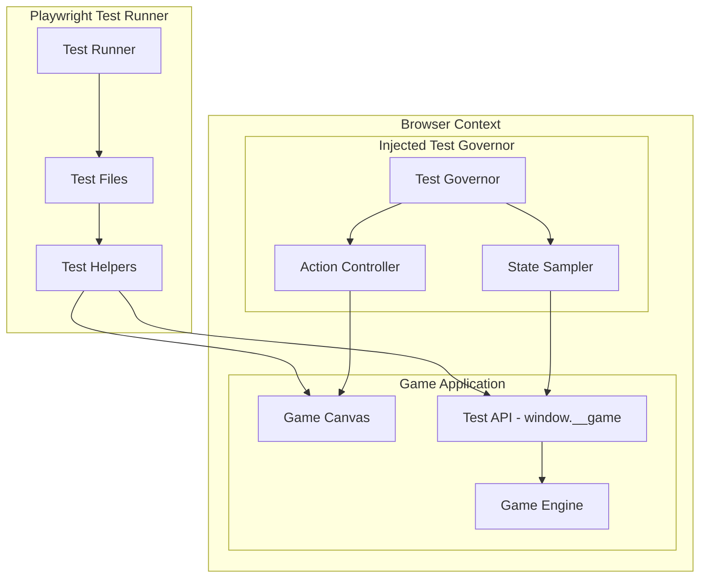

# Design Document: Comprehensive E2E Testing

## Overview

This design document outlines the architecture and implementation strategy for a comprehensive end-to-end testing suite for Farm Follies. The testing suite will use Playwright to automate browser interactions and validate all game behaviors through a combination of direct UI testing and an injected Test Governor that can programmatically control gameplay.

The testing approach leverages the existing `window.__game` test API exposed in development mode, which provides read-only snapshots of game state and allows the Test Governor to make informed decisions about player movement and actions.

## Architecture



### Test Architecture Layers

1. **Test Runner Layer**: Playwright orchestrates test execution, manages browser contexts, and collects results
2. **Test Helper Layer**: Reusable functions for common operations (skip splash, start game, inject governor)
3. **Test Governor Layer**: Injected JavaScript that reads game state and dispatches input events
4. **Game API Layer**: The `window.__game.getTestSnapshot()` interface that exposes game state

## Components and Interfaces

### Test Helper Module

```typescript
// e2e/helpers/game-helpers.ts

interface GameHelpers {
  /** Skip the splash screen by clicking */
  skipSplash(page: Page): Promise<void>;
  
  /** Start a new game, skipping tutorial */
  startGame(page: Page): Promise<void>;
  
  /** Wait for game instance to be available */
  waitForGameInstance(page: Page): Promise<boolean>;
  
  /** Inject the Test Governor for automated play */
  injectGovernor(page: Page, config?: GovernorConfig): Promise<void>;
  
  /** Stop the Test Governor and get stats */
  stopGovernor(page: Page): Promise<GovernorStats>;
  
  /** Get current game state snapshot */
  getSnapshot(page: Page): Promise<GameSnapshot | null>;
  
  /** Wait for specific game conditions */
  waitForCondition(page: Page, condition: ConditionFn, timeout?: number): Promise<void>;
  
  /** Dispatch input events to canvas */
  dispatchCanvasEvent(page: Page, event: CanvasEvent): Promise<void>;
  
  /** Set localStorage values before navigation */
  setStorageValue(page: Page, key: string, value: unknown): Promise<void>;
  
  /** Get localStorage values */
  getStorageValue<T>(page: Page, key: string): Promise<T | null>;
}
```

### Test Governor Interface

```typescript
// Injected into browser context

interface GovernorConfig {
  /** Strategy for catching animals */
  catchStrategy: 'nearest' | 'highest-value' | 'random';
  /** When to bank the stack */
  bankThreshold: number;
  /** Movement speed multiplier */
  speedMultiplier: number;
  /** Whether to activate abilities */
  useAbilities: boolean;
}

interface GovernorStats {
  framesRun: number;
  catchAttempts: number;
  banksTriggered: number;
  idleFrames: number;
  abilitiesUsed: number;
}

interface TestGovernor {
  start(): void;
  stop(): void;
  getStats(): GovernorStats;
  setConfig(config: Partial<GovernorConfig>): void;
}
```

### Game Snapshot Interface

```typescript
// Returned by window.__game.getTestSnapshot()

interface GameSnapshot {
  player: {
    x: number;
    y: number;
    width: number;
    height: number;
  } | null;
  
  fallingAnimals: Array<{
    id: string;
    x: number;
    y: number;
    width: number;
    height: number;
    velocityY: number;
    type?: string;
  }>;
  
  score: number;
  lives: number;
  level: number;
  combo: number;
  stackHeight: number;
  bankedAnimals: number;
  canBank: boolean;
  isPlaying: boolean;
  canvasWidth: number;
  canvasHeight: number;
}
```

### Test Categories

```typescript
// Test organization structure

interface TestCategory {
  name: string;
  description: string;
  testFiles: string[];
}

const TEST_CATEGORIES: TestCategory[] = [
  {
    name: 'collision',
    description: 'Animal catching, missing, power-up collection, bush bouncing',
    testFiles: ['collision-catching.spec.ts', 'collision-missing.spec.ts', 'collision-powerups.spec.ts', 'collision-bushes.spec.ts']
  },
  {
    name: 'boundaries',
    description: 'Player movement limits, spawn positions, screen bounds',
    testFiles: ['boundaries-player.spec.ts', 'boundaries-spawning.spec.ts']
  },
  {
    name: 'state',
    description: 'Game lifecycle, pause/resume, state transitions',
    testFiles: ['state-lifecycle.spec.ts', 'state-pause.spec.ts']
  },
  {
    name: 'scoring',
    description: 'Point calculation, combos, high scores, banking',
    testFiles: ['scoring-points.spec.ts', 'scoring-combos.spec.ts', 'scoring-banking.spec.ts']
  },
  {
    name: 'physics',
    description: 'Wobble mechanics, stack stability, collapse detection',
    testFiles: ['physics-wobble.spec.ts', 'physics-collapse.spec.ts']
  },
  {
    name: 'abilities',
    description: 'Special animal abilities, cooldowns, effects',
    testFiles: ['abilities-activation.spec.ts', 'abilities-effects.spec.ts']
  },
  {
    name: 'input',
    description: 'Mouse, touch, keyboard input handling',
    testFiles: ['input-mouse.spec.ts', 'input-touch.spec.ts', 'input-keyboard.spec.ts']
  },
  {
    name: 'audio',
    description: 'Sound triggers, mute toggle, music state',
    testFiles: ['audio-triggers.spec.ts', 'audio-controls.spec.ts']
  },
  {
    name: 'progression',
    description: 'Levels, achievements, game modes, persistence',
    testFiles: ['progression-levels.spec.ts', 'progression-achievements.spec.ts', 'progression-modes.spec.ts']
  },
  {
    name: 'ui',
    description: 'Component visibility, responsive scaling, tutorial',
    testFiles: ['ui-components.spec.ts', 'ui-responsive.spec.ts', 'ui-tutorial.spec.ts']
  },
  {
    name: 'stability',
    description: 'Error handling, sustained play, no crashes',
    testFiles: ['stability-errors.spec.ts', 'stability-sustained.spec.ts']
  }
];
```

## Data Models

### Test Configuration

```typescript
interface E2ETestConfig {
  /** Base URL for the game */
  baseURL: string;
  
  /** Timeout for waiting operations */
  defaultTimeout: number;
  
  /** Whether to run in headless mode */
  headless: boolean;
  
  /** Viewport configurations to test */
  viewports: ViewportConfig[];
  
  /** Governor configuration defaults */
  governorDefaults: GovernorConfig;
  
  /** Storage keys used by the game */
  storageKeys: {
    highScore: string;
    stats: string;
    achievements: string;
    tutorialComplete: string;
    unlockedModes: string;
  };
}

interface ViewportConfig {
  name: string;
  width: number;
  height: number;
  deviceScaleFactor?: number;
  isMobile?: boolean;
  hasTouch?: boolean;
}

const DEFAULT_VIEWPORTS: ViewportConfig[] = [
  { name: 'mobile', width: 375, height: 812, isMobile: true, hasTouch: true },
  { name: 'tablet', width: 768, height: 1024, isMobile: true, hasTouch: true },
  { name: 'desktop', width: 1920, height: 1080, isMobile: false, hasTouch: false }
];
```

### Test Result Tracking

```typescript
interface TestResult {
  testName: string;
  category: string;
  requirement: string;
  passed: boolean;
  duration: number;
  error?: string;
  screenshots?: string[];
  gameState?: GameSnapshot;
}

interface TestSuiteReport {
  totalTests: number;
  passed: number;
  failed: number;
  skipped: number;
  duration: number;
  results: TestResult[];
  coverage: RequirementCoverage[];
}

interface RequirementCoverage {
  requirementId: string;
  criteriaCount: number;
  testedCount: number;
  passedCount: number;
}
```

### Canvas Event Types

```typescript
type CanvasEventType = 'mousedown' | 'mousemove' | 'mouseup' | 'touchstart' | 'touchmove' | 'touchend';

interface CanvasEvent {
  type: CanvasEventType;
  x: number;
  y: number;
  options?: {
    bubbles?: boolean;
    cancelable?: boolean;
  };
}

interface KeyboardEvent {
  type: 'keydown' | 'keyup';
  code: string;
  key: string;
}
```

### Condition Functions for Waiting

```typescript
type ConditionFn = (snapshot: GameSnapshot) => boolean;

const CONDITIONS = {
  scoreAbove: (min: number): ConditionFn => 
    (snap) => snap.score > min,
  
  livesEqual: (count: number): ConditionFn => 
    (snap) => snap.lives === count,
  
  stackHeightAbove: (min: number): ConditionFn => 
    (snap) => snap.stackHeight > min,
  
  isPlaying: (): ConditionFn => 
    (snap) => snap.isPlaying,
  
  isGameOver: (): ConditionFn => 
    (snap) => !snap.isPlaying && snap.lives === 0,
  
  canBank: (): ConditionFn => 
    (snap) => snap.canBank,
  
  levelAbove: (min: number): ConditionFn => 
    (snap) => snap.level > min,
  
  comboAbove: (min: number): ConditionFn => 
    (snap) => snap.combo > min,
  
  hasFallingAnimals: (): ConditionFn => 
    (snap) => snap.fallingAnimals.length > 0,
  
  noFallingAnimals: (): ConditionFn => 
    (snap) => snap.fallingAnimals.length === 0
};
```


## Correctness Properties

*A property is a characteristic or behavior that should hold true across all valid executions of a system—essentially, a formal statement about what the system should do. Properties serve as the bridge between human-readable specifications and machine-verifiable correctness guarantees.*

Based on the prework analysis, the following correctness properties have been identified for property-based testing. These properties are universally quantified statements that should hold for all valid inputs.

### Property 1: Catch Zone Collision Detection

*For any* animal position within the catch zone bounds (horizontally within player width ± tolerance, vertically at stack top ± catch window), the animal SHALL be caught and added to the stack, and the stack height SHALL increase by exactly 1.

**Validates: Requirements 1.1, 1.4, 1.5, 1.6, 1.7**

### Property 2: Miss Detection and Life Penalty

*For any* animal that falls past the player's bottom boundary (y > player.y + player.height + buffer), the animal SHALL be removed from the game, and IF the player is not invincible THEN lives SHALL decrease by exactly 1.

**Validates: Requirements 2.1, 2.2, 2.3**

### Property 3: Power-Up Collision and Collection

*For any* power-up position that overlaps with the player entity OR any stacked animal entity, the power-up SHALL be collected and removed. *For any* power-up that falls past the player without collision, it SHALL be removed without triggering any effect.

**Validates: Requirements 3.1, 3.2, 3.9**

### Property 4: Bush Bounce Mechanics

*For any* animal falling onto a bush with growthStage >= 0.5, the animal SHALL bounce upward with negative Y velocity. *For any* bush that is bounced on, its bounceStrength SHALL decrease. *For any* bush with growthStage < 0.5, no bounce SHALL occur.

**Validates: Requirements 4.1, 4.2, 4.3, 4.4, 4.5**

### Property 5: Player Boundary Enforcement

*For any* player position update, the resulting X position SHALL be clamped to [minX, maxX] where minX is the left screen edge plus padding and maxX is the right screen edge minus bank width minus padding. *For any* player reaching a boundary with non-zero velocity, the velocity SHALL be reversed and reduced.

**Validates: Requirements 5.1, 5.2, 5.3**

### Property 6: Spawn Position Validity

*For any* animal spawned by the tornado, the spawn X position SHALL be within [0, canvasWidth - bankWidth]. *For any* power-up spawned, the spawn position SHALL be within the playable area. *For any* entity drifting horizontally, it SHALL remain within screen bounds.

**Validates: Requirements 6.1, 6.4, 7.1, 7.2**

### Property 7: Tornado Boundary Behavior

*For any* tornado position at or beyond the left boundary, the tornado direction SHALL be positive (moving right). *For any* tornado position at or beyond the right boundary (minus bank width), the tornado direction SHALL be negative (moving left).

**Validates: Requirements 6.2, 6.3**

### Property 8: Pause State Freeze

*For any* game state snapshot taken while paused, comparing it to a snapshot taken after a delay while still paused, the following SHALL be equal: falling animal positions, score, power-up timer values, and falling animal count SHALL not increase.

**Validates: Requirements 9.1, 9.2, 9.3, 9.4, 9.5**

### Property 9: Score Calculation Consistency

*For any* animal catch event, the score increase SHALL be >= base points for that animal type. *For any* perfect catch, the score increase SHALL include the perfect bonus. *For any* catch while double points is active, the score increase SHALL be exactly 2x the normal increase.

**Validates: Requirements 10.1, 10.2, 10.5**

### Property 10: Combo Mechanics

*For any* sequence of consecutive catches within the combo window, the combo counter SHALL increase by 1 for each catch. *For any* period exceeding the combo decay time without a catch, the combo SHALL reset to 0. *For any* miss event, the combo SHALL reset to 0.

**Validates: Requirements 10.3, 10.4, 30.1, 30.2, 30.3, 30.4, 30.5**

### Property 11: High Score Persistence Round-Trip

*For any* game session that ends with a score higher than the stored high score, saving and then reloading the application SHALL result in the new high score being displayed. *For any* game session that ends with a score lower than the stored high score, the stored high score SHALL remain unchanged.

**Validates: Requirements 11.1, 11.2, 11.3**

### Property 12: Banking Threshold and Mechanics

*For any* stack with fewer than 5 animals, the canBank flag SHALL be false. *For any* stack with 5 or more animals, the canBank flag SHALL be true. *For any* successful bank operation, the stack SHALL be cleared (length = 0) and bankedAnimals SHALL increase by the previous stack length.

**Validates: Requirements 12.1, 12.2, 12.3, 12.4, 12.5**

### Property 13: Wobble Physics Behavior

*For any* player movement with velocity > threshold, wobble intensity SHALL increase. *For any* stack height increase, wobble amplitude SHALL increase proportionally. *For any* wobble intensity exceeding the collapse threshold, the stack SHALL topple, a life SHALL be lost, and the stack SHALL be cleared.

**Validates: Requirements 13.1, 13.2, 13.3, 13.4, 13.5, 13.6, 13.7**

### Property 14: Input Position Tracking

*For any* mouse drag event sequence on the canvas, the player X position SHALL converge toward the drag X position. *For any* touch drag event sequence on the canvas, the player X position SHALL converge toward the touch X position.

**Validates: Requirements 15.1, 15.2, 15.4**

### Property 15: Level Progression Scaling

*For any* level increase, the spawn interval SHALL decrease (faster spawns). *For any* level increase, the special variant spawn chance SHALL increase. *For any* level at the maximum value, further score increases SHALL NOT increase the level.

**Validates: Requirements 19.1, 19.2, 19.3, 19.4, 19.5**

### Property 16: Runtime Stability

*For any* gameplay session of duration T, the number of JavaScript errors logged SHALL be 0 (excluding expected audio context warnings). *For any* gameplay session, the number of uncaught exceptions SHALL be 0.

**Validates: Requirements 24.1, 24.2, 24.3, 24.4, 24.5**

### Property 17: Data Persistence Round-Trip

*For any* stats object saved to storage, reloading the application and reading stats SHALL return an equivalent object. *For any* achievements unlocked and saved, reloading SHALL show those achievements as unlocked. *For any* game modes unlocked and saved, reloading SHALL show those modes as unlocked.

**Validates: Requirements 27.1, 27.2, 27.3, 27.4, 27.5**

### Property 18: Animal Type Spawn Coverage

*For any* gameplay session of sufficient duration (30+ seconds with spawning), the set of animal types that have spawned SHALL include all 9 animal types (chicken, duck, pig, sheep, goat, cow, goose, horse, rooster) with probability approaching 1 as duration increases.

**Validates: Requirements 28.1, 28.2, 28.3, 28.4, 28.5, 28.6, 28.7, 28.8, 28.9, 28.10**

### Property 19: Power-Up Type Spawn Coverage

*For any* gameplay session of sufficient duration with power-up spawning enabled, the set of power-up types that have spawned SHALL include all 6 types (hay_bale, golden_egg, water_trough, salt_lick, corn_feed, lucky_horseshoe) with probability approaching 1 as duration increases.

**Validates: Requirements 29.1, 29.2, 29.3, 29.4, 29.5, 29.6**

## Error Handling

### Browser Console Errors

The E2E test suite SHALL monitor browser console for errors during all test execution. Expected/benign errors that should be filtered:
- AudioContext warnings (browser autoplay policy)
- Network errors for optional assets (net::ERR_*)
- NotAllowedError for audio playback

Any other console errors SHALL cause the test to fail.

### Uncaught Exceptions

The E2E test suite SHALL register a `pageerror` handler to catch uncaught exceptions. Any uncaught exception SHALL cause the test to fail immediately.

### Timeout Handling

All wait operations SHALL have configurable timeouts with sensible defaults:
- Game instance availability: 5000ms
- UI element visibility: 3000ms
- Game state conditions: 15000ms
- Governor frame count: 15000ms

Timeout failures SHALL include the condition being waited for and the last known game state.

### Screenshot on Failure

When a test fails, the E2E suite SHALL capture:
1. A screenshot of the current page state
2. The current game state snapshot (if available)
3. The browser console log

### Recovery Strategies

For flaky tests, the suite SHALL support:
- Automatic retry with configurable count
- Fresh browser context for each retry
- Clearing localStorage between retries

## Testing Strategy

### Dual Testing Approach

The E2E test suite employs two complementary testing approaches:

1. **Example-Based Tests**: Verify specific scenarios, edge cases, and UI interactions
   - State transitions (splash → menu → game → pause → resume → game over)
   - UI component visibility at each state
   - Specific power-up effects
   - Achievement unlock conditions
   - Keyboard input bindings
   - Audio trigger events

2. **Property-Based Tests**: Verify universal properties across randomized inputs
   - Collision detection correctness
   - Boundary enforcement
   - Score calculation consistency
   - Persistence round-trips
   - Runtime stability

### Property-Based Testing Configuration

- **Library**: Custom property testing using Playwright's test.each with generated inputs
- **Iterations**: Minimum 100 iterations per property test
- **Seed**: Configurable random seed for reproducibility
- **Shrinking**: Manual shrinking by re-running with smaller input ranges on failure

Each property test SHALL be tagged with:
```typescript
// Feature: comprehensive-e2e-testing, Property N: [property description]
```

### Test Organization

```
e2e/
├── helpers/
│   ├── game-helpers.ts      # Common test utilities
│   ├── governor.ts          # Test Governor implementation
│   ├── conditions.ts        # Wait condition functions
│   └── generators.ts        # Input generators for property tests
├── collision/
│   ├── catching.spec.ts     # Property 1: Catch zone collision
│   ├── missing.spec.ts      # Property 2: Miss detection
│   ├── powerups.spec.ts     # Property 3: Power-up collision
│   └── bushes.spec.ts       # Property 4: Bush bounce
├── boundaries/
│   ├── player.spec.ts       # Property 5: Player boundaries
│   ├── spawning.spec.ts     # Properties 6, 7: Spawn boundaries
│   └── tornado.spec.ts      # Property 7: Tornado boundaries
├── state/
│   ├── lifecycle.spec.ts    # State transition examples
│   └── pause.spec.ts        # Property 8: Pause freeze
├── scoring/
│   ├── points.spec.ts       # Property 9: Score calculation
│   ├── combos.spec.ts       # Property 10: Combo mechanics
│   ├── banking.spec.ts      # Property 12: Banking mechanics
│   └── highscore.spec.ts    # Property 11: High score persistence
├── physics/
│   └── wobble.spec.ts       # Property 13: Wobble physics
├── input/
│   ├── mouse.spec.ts        # Property 14: Mouse input
│   ├── touch.spec.ts        # Property 14: Touch input
│   └── keyboard.spec.ts     # Keyboard input examples
├── abilities/
│   └── activation.spec.ts   # Ability activation examples
├── progression/
│   ├── levels.spec.ts       # Property 15: Level progression
│   ├── achievements.spec.ts # Achievement examples
│   └── modes.spec.ts        # Game mode examples
├── coverage/
│   ├── animals.spec.ts      # Property 18: Animal type coverage
│   └── powerups.spec.ts     # Property 19: Power-up type coverage
├── persistence/
│   └── storage.spec.ts      # Property 17: Data persistence
├── stability/
│   └── runtime.spec.ts      # Property 16: Runtime stability
└── ui/
    ├── components.spec.ts   # UI visibility examples
    ├── responsive.spec.ts   # Viewport examples
    └── tutorial.spec.ts     # Tutorial examples
```

### Test Execution

```bash
# Run all E2E tests
pnpm exec playwright test

# Run specific category
pnpm exec playwright test e2e/collision/

# Run with specific viewport
pnpm exec playwright test --project=mobile

# Run property tests only
pnpm exec playwright test --grep "Property"

# Run with visible browser
pnpm exec playwright test --headed

# Generate HTML report
pnpm exec playwright test --reporter=html
```

### CI/CD Integration

The test suite SHALL be configured for CI with:
- Parallel execution across multiple workers
- Retry on failure (2 retries)
- Screenshot and trace collection on failure
- JUnit XML output for CI integration
- HTML report generation
